# 🗄️ Sistema Hospitalario - Diagrama de Base de Datos

## Descripción General
Base de datos SQLite que gestiona toda la información del sistema hospitalario, incluyendo usuarios, pacientes, tratamientos, medicamentos, auditoría y seguridad.

## Diagrama Entidad-Relación (ERD)

```mermaid
erDiagram
    USERS ||--o{ NURSE_NOTES : "crea"
    USERS ||--o{ AUDIT_LOGS : "genera"
    USERS ||--o{ PATIENT_ASSIGNMENTS : "tiene"
    USERS ||--o{ SHIFT_ASSIGNMENTS : "asignado"
    USERS ||--o{ LOGIN_ATTEMPTS : "registra"
    USERS ||--o{ ACCOUNT_LOCKOUTS : "puede_tener"
    USERS ||--o{ PASSWORD_RESET_TOKENS : "solicita"
    
    PATIENTS ||--o{ APPOINTMENTS : "tiene"
    PATIENTS ||--o{ TREATMENTS : "recibe"
    PATIENTS ||--o{ VITAL_SIGNS : "monitorizado"
    PATIENTS ||--o{ NURSE_NOTES : "documentado"
    PATIENTS ||--o{ MEDICAL_HISTORY : "posee"
    PATIENTS ||--o{ LAB_TESTS : "realiza"
    PATIENTS ||--o{ PATIENT_ASSIGNMENTS : "asignado_a"
    PATIENTS ||--o{ NON_PHARMACOLOGICAL_TREATMENTS : "recibe"
    PATIENTS ||--o{ MEDICATION_ADMINISTRATION : "recibe"
    PATIENTS ||--o{ MEDICATION_DISPENSATIONS : "recibe"
    PATIENTS ||--o{ BEDS : "ocupa"
    
    NURSE_NOTES ||--o{ EDIT_HISTORY : "tiene_historial"
    
    MEDICATION_INVENTORY ||--o{ MEDICATION_DISPENSATIONS : "dispensado"
    MEDICATION_INVENTORY ||--o{ MEDICATION_ADMINISTRATION : "administrado"
    
    USERS {
        INTEGER id PK
        TEXT username UK
        TEXT name
        TEXT role
        TEXT cedula UK
        TEXT email
        TEXT password_hash
        TEXT license_number
        TEXT specialty
        TEXT assigned_shifts
        INTEGER is_active
        TEXT last_login
        INTEGER failed_attempts
        INTEGER account_locked
        TEXT created_at
    }
    
    PATIENTS {
        INTEGER id PK
        TEXT name
        INTEGER age
        TEXT curp UK
        TEXT gender
        TEXT contact
        TEXT address
        TEXT room
        TEXT condition
        TEXT triage_level
        TEXT admission_date
        TEXT discharge_date
        TEXT blood_type
        TEXT allergies
        TEXT diagnosis
        TEXT primary_doctor
        INTEGER assigned_nurse_id FK
        TEXT status
        TEXT floor
        TEXT area
        TEXT bed
    }
    
    APPOINTMENTS {
        INTEGER id PK
        INTEGER patient_id FK
        TEXT date
        TEXT time
        TEXT doctor
        TEXT reason
        TEXT status
        TEXT notes
        TEXT created_at
    }
    
    TREATMENTS {
        INTEGER id PK
        INTEGER patient_id FK
        TEXT medication
        TEXT dosage
        TEXT frequency
        TEXT start_date
        TEXT end_date
        TEXT prescribed_by
        TEXT status
        TEXT notes
    }
    
    VITAL_SIGNS {
        INTEGER id PK
        INTEGER patient_id FK
        TEXT date
        TEXT temperature
        TEXT blood_pressure
        TEXT heart_rate
        TEXT respiratory_rate
        TEXT oxygen_saturation
        TEXT weight
        TEXT height
        TEXT pain_level
        TEXT registered_by
        TEXT notes
    }
    
    NURSE_NOTES {
        INTEGER id PK
        INTEGER patient_id FK
        INTEGER nurse_id FK
        TEXT nurse_name
        TEXT shift
        TEXT content
        TEXT category
        TEXT priority
        TEXT created_at
        TEXT updated_at
        INTEGER is_edited
        INTEGER edit_count
    }
    
    EDIT_HISTORY {
        INTEGER id PK
        INTEGER note_id FK
        TEXT edited_by
        TEXT edited_by_role
        TEXT edit_reason
        TEXT old_content
        TEXT new_content
        TEXT edit_timestamp
        INTEGER time_since_creation
    }
    
    MEDICATION_INVENTORY {
        INTEGER id PK
        TEXT name
        TEXT active_ingredient
        TEXT presentation
        TEXT concentration
        TEXT category
        INTEGER is_controlled
        INTEGER quantity
        TEXT unit
        INTEGER min_stock
        INTEGER max_stock
        REAL unit_price
        TEXT supplier
        TEXT lot_number
        TEXT expiration_date
        TEXT location
        TEXT storage_conditions
        TEXT last_restocked
        TEXT last_dispensed
        TEXT status
        TEXT created_at
        TEXT updated_at
    }
    
    MEDICATION_DISPENSATIONS {
        INTEGER id PK
        INTEGER medication_id FK
        TEXT medication_name
        INTEGER patient_id FK
        TEXT patient_name
        INTEGER quantity
        TEXT dispensed_by
        TEXT doctor_prescription
        TEXT lot_number
        INTEGER stock_before
        INTEGER stock_after
        TEXT reason
        TEXT created_at
    }
    
    PATIENT_ASSIGNMENTS {
        INTEGER id PK
        INTEGER nurse_id FK
        INTEGER patient_id FK
        TEXT assignment_date
        TEXT shift_type
        TEXT status
        TEXT notes
    }
    
    AUDIT_LOGS {
        INTEGER id PK
        INTEGER user_id FK
        TEXT action
        TEXT table_name
        INTEGER record_id
        TEXT old_values
        TEXT new_values
        TEXT ip_address
        TEXT user_agent
        TEXT timestamp
    }
    
    LOGIN_ATTEMPTS {
        INTEGER id PK
        TEXT cedula
        INTEGER success
        TEXT ip_address
        TEXT user_agent
        TEXT attempted_at
    }
    
    ACCOUNT_LOCKOUTS {
        INTEGER id PK
        TEXT cedula FK
        TEXT reason
        TEXT locked_at
        TEXT locked_until
        TEXT locked_by
    }
    
    SYSTEM_ERRORS {
        INTEGER id PK
        TEXT error_type
        TEXT error_message
        TEXT stack_trace
        TEXT component
        INTEGER user_id FK
        TEXT user_action
        TEXT occurred_at
        TEXT status
        TEXT resolved_at
        TEXT resolved_by
    }
    
    PASSWORD_RESET_TOKENS {
        INTEGER id PK
        INTEGER user_id FK
        TEXT username
        TEXT token UK
        TEXT created_at
        TEXT expires_at
        INTEGER is_used
        TEXT used_at
        TEXT ip_address
    }
    
    NON_PHARMACOLOGICAL_TREATMENTS {
        INTEGER id PK
        INTEGER patient_id FK
        TEXT treatment_type
        TEXT description
        TEXT application_date
        INTEGER duration_minutes
        TEXT performed_by
        TEXT outcome
        TEXT created_at
    }
    
    MEDICATION_ADMINISTRATION {
        INTEGER id PK
        INTEGER patient_id FK
        INTEGER nurse_id FK
        INTEGER medication_id FK
        INTEGER prescription_id
        TEXT administration_time
        TEXT notes
        TEXT created_at
    }
    
    SHIFT_ASSIGNMENTS {
        INTEGER id PK
        INTEGER user_id FK
        TEXT username
        TEXT shift_type
        TEXT day_of_week
        TEXT start_time
        TEXT end_time
        TEXT date
        INTEGER is_active
        TEXT created_at
    }
    
    MEDICAL_HISTORY {
        INTEGER id PK
        INTEGER patient_id FK
        TEXT date
        TEXT description
        TEXT diagnosis
        TEXT treatment
        TEXT doctor
        TEXT notes
        TEXT created_at
    }
    
    LAB_TESTS {
        INTEGER id PK
        INTEGER patient_id FK
        TEXT test_type
        TEXT test_name
        TEXT ordered_by
        TEXT order_date
        TEXT status
        TEXT results
        TEXT result_date
        TEXT performed_by
        TEXT notes
    }
    
    BEDS {
        INTEGER id PK
        TEXT bed_number UK
        TEXT floor
        TEXT room
        TEXT bed_type
        TEXT status
        INTEGER patient_id FK
        TEXT patient_name
        TEXT assigned_date
        TEXT discharge_date
        TEXT notes
    }
```

## Estructura Detallada de Tablas

### 1. **USERS** - Usuarios del Sistema
Almacena información de todos los usuarios del sistema (administradores, doctores, enfermeros, pacientes).

| Campo | Tipo | Descripción |
|-------|------|-------------|
| id | INTEGER | Identificador único (PK) |
| username | TEXT | Nombre de usuario único |
| name | TEXT | Nombre completo |
| role | TEXT | Rol: 'admin', 'doctor', 'nurse', 'patient' |
| cedula | TEXT | Cédula profesional única |
| email | TEXT | Correo electrónico |
| password_hash | TEXT | Contraseña hasheada |
| license_number | TEXT | Número de licencia profesional |
| specialty | TEXT | Especialidad médica |
| assigned_shifts | TEXT | Turnos asignados (JSON) |
| is_active | INTEGER | Usuario activo (boolean) |
| last_login | TEXT | Último inicio de sesión |
| failed_attempts | INTEGER | Intentos fallidos de login |
| account_locked | INTEGER | Cuenta bloqueada (boolean) |
| created_at | TEXT | Fecha de creación |

### 2. **PATIENTS** - Pacientes
Información completa de los pacientes del hospital.

| Campo | Tipo | Descripción |
|-------|------|-------------|
| id | INTEGER | Identificador único (PK) |
| name | TEXT | Nombre completo |
| age | INTEGER | Edad |
| curp | TEXT | CURP único |
| gender | TEXT | Género |
| contact | TEXT | Teléfono de contacto |
| address | TEXT | Dirección |
| room | TEXT | Número de habitación |
| condition | TEXT | Condición actual |
| triage_level | TEXT | Nivel de triage (ROJO/NARANJA/AMARILLO/VERDE) |
| admission_date | TEXT | Fecha de ingreso |
| discharge_date | TEXT | Fecha de alta |
| blood_type | TEXT | Tipo de sangre |
| allergies | TEXT | Alergias conocidas |
| diagnosis | TEXT | Diagnóstico |
| primary_doctor | TEXT | Doctor principal |
| assigned_nurse_id | INTEGER | ID enfermero asignado (FK) |
| status | TEXT | Estado actual |
| floor | TEXT | Piso del hospital |
| area | TEXT | Área del hospital |
| bed | TEXT | Número de cama |

### 3. **APPOINTMENTS** - Citas Médicas
Gestión de citas entre pacientes y doctores.

| Campo | Tipo | Descripción |
|-------|------|-------------|
| id | INTEGER | Identificador único (PK) |
| patient_id | INTEGER | ID del paciente (FK) |
| date | TEXT | Fecha de la cita |
| time | TEXT | Hora de la cita |
| doctor | TEXT | Nombre del doctor |
| reason | TEXT | Motivo de la cita |
| status | TEXT | Estado: 'Programada', 'Completada', 'Cancelada' |
| notes | TEXT | Notas adicionales |
| created_at | TEXT | Fecha de creación |

### 4. **TREATMENTS** - Tratamientos
Tratamientos y medicaciones prescritas.

| Campo | Tipo | Descripción |
|-------|------|-------------|
| id | INTEGER | Identificador único (PK) |
| patient_id | INTEGER | ID del paciente (FK) |
| medication | TEXT | Nombre del medicamento |
| dosage | TEXT | Dosis prescrita |
| frequency | TEXT | Frecuencia de administración |
| start_date | TEXT | Fecha de inicio |
| end_date | TEXT | Fecha de finalización |
| prescribed_by | TEXT | Prescrito por |
| status | TEXT | Estado del tratamiento |
| notes | TEXT | Notas adicionales |

### 5. **VITAL_SIGNS** - Signos Vitales
Registro de signos vitales de los pacientes.

| Campo | Tipo | Descripción |
|-------|------|-------------|
| id | INTEGER | Identificador único (PK) |
| patient_id | INTEGER | ID del paciente (FK) |
| date | TEXT | Fecha y hora del registro |
| temperature | TEXT | Temperatura corporal |
| blood_pressure | TEXT | Presión arterial |
| heart_rate | TEXT | Frecuencia cardíaca |
| respiratory_rate | TEXT | Frecuencia respiratoria |
| oxygen_saturation | TEXT | Saturación de oxígeno |
| weight | TEXT | Peso |
| height | TEXT | Altura |
| pain_level | TEXT | Nivel de dolor (0-10) |
| registered_by | TEXT | Registrado por |
| notes | TEXT | Notas adicionales |

### 6. **NURSE_NOTES** - Notas de Enfermería
Notas clínicas del personal de enfermería.

| Campo | Tipo | Descripción |
|-------|------|-------------|
| id | INTEGER | Identificador único (PK) |
| patient_id | INTEGER | ID del paciente (FK) |
| nurse_id | INTEGER | ID del enfermero (FK) |
| nurse_name | TEXT | Nombre del enfermero |
| shift | TEXT | Turno (Matutino/Vespertino/Nocturno) |
| content | TEXT | Contenido de la nota |
| category | TEXT | Categoría de la nota |
| priority | TEXT | Prioridad (Alta/Media/Baja) |
| created_at | TEXT | Fecha de creación |
| updated_at | TEXT | Última actualización |
| is_edited | INTEGER | Si fue editada (boolean) |
| edit_count | INTEGER | Número de ediciones |

### 7. **EDIT_HISTORY** - Historial de Ediciones
Trazabilidad de ediciones en notas de enfermería.

| Campo | Tipo | Descripción |
|-------|------|-------------|
| id | INTEGER | Identificador único (PK) |
| note_id | INTEGER | ID de la nota (FK) |
| edited_by | TEXT | Editado por |
| edited_by_role | TEXT | Rol del editor |
| edit_reason | TEXT | Razón de la edición |
| old_content | TEXT | Contenido anterior |
| new_content | TEXT | Contenido nuevo |
| edit_timestamp | TEXT | Fecha de edición |
| time_since_creation | INTEGER | Minutos desde creación |

### 8. **MEDICATION_INVENTORY** - Inventario de Medicamentos
Control de stock de medicamentos (NOM-176-SSA1-1998).

| Campo | Tipo | Descripción |
|-------|------|-------------|
| id | INTEGER | Identificador único (PK) |
| name | TEXT | Nombre del medicamento |
| active_ingredient | TEXT | Ingrediente activo |
| presentation | TEXT | Presentación |
| concentration | TEXT | Concentración |
| category | TEXT | Categoría (ESTANDAR/ANTIBIOTICO/etc) |
| is_controlled | INTEGER | Es controlado (boolean) |
| quantity | INTEGER | Cantidad en stock |
| unit | TEXT | Unidad de medida |
| min_stock | INTEGER | Stock mínimo |
| max_stock | INTEGER | Stock máximo |
| unit_price | REAL | Precio unitario |
| supplier | TEXT | Proveedor |
| lot_number | TEXT | Número de lote |
| expiration_date | TEXT | Fecha de caducidad |
| location | TEXT | Ubicación en farmacia |
| storage_conditions | TEXT | Condiciones de almacenamiento |
| last_restocked | TEXT | Último reabastecimiento |
| last_dispensed | TEXT | Última dispensación |
| status | TEXT | Estado (active/expired/low_stock) |
| created_at | TEXT | Fecha de creación |
| updated_at | TEXT | Última actualización |

### 9. **MEDICATION_DISPENSATIONS** - Dispensación de Medicamentos
Registro de medicamentos dispensados.

| Campo | Tipo | Descripción |
|-------|------|-------------|
| id | INTEGER | Identificador único (PK) |
| medication_id | INTEGER | ID del medicamento (FK) |
| medication_name | TEXT | Nombre del medicamento |
| patient_id | INTEGER | ID del paciente (FK) |
| patient_name | TEXT | Nombre del paciente |
| quantity | INTEGER | Cantidad dispensada |
| dispensed_by | TEXT | Dispensado por |
| doctor_prescription | TEXT | Prescripción médica |
| lot_number | TEXT | Número de lote |
| stock_before | INTEGER | Stock antes |
| stock_after | INTEGER | Stock después |
| reason | TEXT | Motivo |
| created_at | TEXT | Fecha de dispensación |

### 10. **PATIENT_ASSIGNMENTS** - Asignaciones de Pacientes
Asignación de pacientes a enfermeros por turno.

| Campo | Tipo | Descripción |
|-------|------|-------------|
| id | INTEGER | Identificador único (PK) |
| nurse_id | INTEGER | ID del enfermero (FK) |
| patient_id | INTEGER | ID del paciente (FK) |
| assignment_date | TEXT | Fecha de asignación |
| shift_type | TEXT | Tipo de turno |
| status | TEXT | Estado de la asignación |
| notes | TEXT | Notas |

### 11. **AUDIT_LOGS** - Registros de Auditoría
Auditoría completa de todas las acciones del sistema.

| Campo | Tipo | Descripción |
|-------|------|-------------|
| id | INTEGER | Identificador único (PK) |
| user_id | INTEGER | ID del usuario (FK) |
| action | TEXT | Acción realizada |
| table_name | TEXT | Tabla afectada |
| record_id | INTEGER | ID del registro |
| old_values | TEXT | Valores anteriores (JSON) |
| new_values | TEXT | Valores nuevos (JSON) |
| ip_address | TEXT | Dirección IP |
| user_agent | TEXT | Agente de usuario |
| timestamp | TEXT | Fecha y hora |

### 12. **LOGIN_ATTEMPTS** - Intentos de Inicio de Sesión
Registro de intentos de login para seguridad.

| Campo | Tipo | Descripción |
|-------|------|-------------|
| id | INTEGER | Identificador único (PK) |
| cedula | TEXT | Cédula intentada |
| success | INTEGER | Exitoso (boolean) |
| ip_address | TEXT | Dirección IP |
| user_agent | TEXT | Agente de usuario |
| attempted_at | TEXT | Fecha y hora |

### 13. **ACCOUNT_LOCKOUTS** - Bloqueos de Cuenta
Gestión de cuentas bloqueadas por seguridad.

| Campo | Tipo | Descripción |
|-------|------|-------------|
| id | INTEGER | Identificador único (PK) |
| cedula | TEXT | Cédula bloqueada (FK) |
| reason | TEXT | Razón del bloqueo |
| locked_at | TEXT | Fecha de bloqueo |
| locked_until | TEXT | Bloqueado hasta |
| locked_by | TEXT | Bloqueado por |

### 14. **SYSTEM_ERRORS** - Errores del Sistema
Registro centralizado de errores.

| Campo | Tipo | Descripción |
|-------|------|-------------|
| id | INTEGER | Identificador único (PK) |
| error_type | TEXT | Tipo de error |
| error_message | TEXT | Mensaje de error |
| stack_trace | TEXT | Traza de la pila |
| component | TEXT | Componente afectado |
| user_id | INTEGER | ID del usuario (FK) |
| user_action | TEXT | Acción que causó el error |
| occurred_at | TEXT | Fecha de ocurrencia |
| status | TEXT | Estado (new/resolved) |
| resolved_at | TEXT | Fecha de resolución |
| resolved_by | TEXT | Resuelto por |

### 15. **PASSWORD_RESET_TOKENS** - Tokens de Restablecimiento
Gestión de recuperación de contraseñas.

| Campo | Tipo | Descripción |
|-------|------|-------------|
| id | INTEGER | Identificador único (PK) |
| user_id | INTEGER | ID del usuario (FK) |
| username | TEXT | Nombre de usuario |
| token | TEXT | Token único |
| created_at | TEXT | Fecha de creación |
| expires_at | TEXT | Fecha de expiración |
| is_used | INTEGER | Si fue usado (boolean) |
| used_at | TEXT | Fecha de uso |
| ip_address | TEXT | Dirección IP |

### 16. **NON_PHARMACOLOGICAL_TREATMENTS** - Tratamientos No Farmacológicos
Registro de terapias físicas y otras intervenciones.

| Campo | Tipo | Descripción |
|-------|------|-------------|
| id | INTEGER | Identificador único (PK) |
| patient_id | INTEGER | ID del paciente (FK) |
| treatment_type | TEXT | Tipo de tratamiento |
| description | TEXT | Descripción |
| application_date | TEXT | Fecha de aplicación |
| duration_minutes | INTEGER | Duración en minutos |
| performed_by | TEXT | Realizado por |
| outcome | TEXT | Resultado |
| created_at | TEXT | Fecha de creación |

### 17. **MEDICATION_ADMINISTRATION** - Administración de Medicamentos
Registro de medicamentos administrados.

| Campo | Tipo | Descripción |
|-------|------|-------------|
| id | INTEGER | Identificador único (PK) |
| patient_id | INTEGER | ID del paciente (FK) |
| nurse_id | INTEGER | ID del enfermero (FK) |
| medication_id | INTEGER | ID del medicamento (FK) |
| prescription_id | INTEGER | ID de la prescripción |
| administration_time | TEXT | Hora de administración |
| notes | TEXT | Notas |
| created_at | TEXT | Fecha de creación |

### 18. **SHIFT_ASSIGNMENTS** - Asignación de Turnos
Horarios de trabajo del personal.

| Campo | Tipo | Descripción |
|-------|------|-------------|
| id | INTEGER | Identificador único (PK) |
| user_id | INTEGER | ID del usuario (FK) |
| username | TEXT | Nombre de usuario |
| shift_type | TEXT | Tipo de turno |
| day_of_week | TEXT | Día de la semana |
| start_time | TEXT | Hora de inicio |
| end_time | TEXT | Hora de fin |
| date | TEXT | Fecha específica |
| is_active | INTEGER | Activo (boolean) |
| created_at | TEXT | Fecha de creación |

### 19. **MEDICAL_HISTORY** - Historial Médico
Historial médico completo de los pacientes.

| Campo | Tipo | Descripción |
|-------|------|-------------|
| id | INTEGER | Identificador único (PK) |
| patient_id | INTEGER | ID del paciente (FK) |
| date | TEXT | Fecha del evento |
| description | TEXT | Descripción |
| diagnosis | TEXT | Diagnóstico |
| treatment | TEXT | Tratamiento aplicado |
| doctor | TEXT | Doctor responsable |
| notes | TEXT | Notas adicionales |
| created_at | TEXT | Fecha de creación |

### 20. **LAB_TESTS** - Pruebas de Laboratorio
Gestión de análisis clínicos.

| Campo | Tipo | Descripción |
|-------|------|-------------|
| id | INTEGER | Identificador único (PK) |
| patient_id | INTEGER | ID del paciente (FK) |
| test_type | TEXT | Tipo de prueba |
| test_name | TEXT | Nombre de la prueba |
| ordered_by | TEXT | Ordenado por |
| order_date | TEXT | Fecha de orden |
| status | TEXT | Estado (Pendiente/En proceso/Completado) |
| results | TEXT | Resultados |
| result_date | TEXT | Fecha de resultados |
| performed_by | TEXT | Realizado por |
| notes | TEXT | Notas |

### 21. **BEDS** - Gestión de Camas
Control de disponibilidad de camas hospitalarias.

| Campo | Tipo | Descripción |
|-------|------|-------------|
| id | INTEGER | Identificador único (PK) |
| bed_number | TEXT | Número de cama único |
| floor | TEXT | Piso del hospital |
| room | TEXT | Número de habitación |
| bed_type | TEXT | Tipo de cama |
| status | TEXT | Estado (Disponible/Ocupada/Mantenimiento) |
| patient_id | INTEGER | ID del paciente (FK) |
| patient_name | TEXT | Nombre del paciente |
| assigned_date | TEXT | Fecha de asignación |
| discharge_date | TEXT | Fecha de alta |
| notes | TEXT | Notas |

## Relaciones Principales

### Relaciones Uno a Muchos (1:N)

1. **USERS → NURSE_NOTES**: Un usuario puede crear múltiples notas
2. **USERS → AUDIT_LOGS**: Un usuario genera múltiples registros de auditoría
3. **USERS → PATIENT_ASSIGNMENTS**: Un enfermero puede tener múltiples asignaciones
4. **PATIENTS → APPOINTMENTS**: Un paciente puede tener múltiples citas
5. **PATIENTS → TREATMENTS**: Un paciente puede recibir múltiples tratamientos
6. **PATIENTS → VITAL_SIGNS**: Un paciente tiene múltiples registros de signos vitales
7. **PATIENTS → NURSE_NOTES**: Un paciente es documentado en múltiples notas
8. **NURSE_NOTES → EDIT_HISTORY**: Una nota puede tener múltiples ediciones
9. **MEDICATION_INVENTORY → DISPENSATIONS**: Un medicamento puede ser dispensado múltiples veces

### Relaciones Uno a Uno (1:1)

1. **PATIENTS ↔ BEDS**: Un paciente ocupa una cama (cuando está ocupada)

## Índices y Optimizaciones

### Claves Primarias (PK)
Todas las tablas tienen un campo `id` como clave primaria autoincremental.

### Claves Foráneas (FK)
- `patient_id` en múltiples tablas referencia a `PATIENTS(id)`
- `nurse_id` / `user_id` en múltiples tablas referencia a `USERS(id)`
- `medication_id` referencia a `MEDICATION_INVENTORY(id)`
- `note_id` en `EDIT_HISTORY` referencia a `NURSE_NOTES(id)`

### Claves Únicas (UK)
- `USERS.username`: Nombre de usuario único
- `USERS.cedula`: Cédula profesional única
- `PATIENTS.curp`: CURP único
- `MEDICATION_INVENTORY.name`: Nombre de medicamento único
- `BEDS.bed_number`: Número de cama único
- `PASSWORD_RESET_TOKENS.token`: Token único

## Cumplimiento Normativo

### NOM-004-SSA3-2012 (Expediente Clínico)
- ✅ Registro completo de pacientes
- ✅ Historial médico detallado
- ✅ Signos vitales con trazabilidad
- ✅ Notas de enfermería con control de ediciones
- ✅ Auditoría de todas las modificaciones

### NOM-176-SSA1-1998 (Medicamentos)
- ✅ Control de inventario de medicamentos
- ✅ Registro de medicamentos controlados
- ✅ Trazabilidad de dispensación
- ✅ Control de lotes y caducidad
- ✅ Condiciones de almacenamiento

### Seguridad y Privacidad
- ✅ Control de acceso por roles
- ✅ Registro de intentos de login
- ✅ Bloqueo automático de cuentas
- ✅ Auditoría completa de acciones
- ✅ Recuperación segura de contraseñas

## Características Técnicas

### Gestión de Datos
- **Motor**: SQLite 3
- **Integridad Referencial**: Habilitada mediante Foreign Keys
- **Transacciones**: Soporte completo ACID
- **Codificación**: UTF-8
- **Timestamps**: ISO 8601 format (YYYY-MM-DD HH:MM:SS)

### Seguridad
- Contraseñas hasheadas (nunca en texto plano)
- Tokens de sesión con expiración
- Validación de integridad en cada operación
- Registro completo de auditoría

### Rendimiento
- Índices automáticos en claves primarias
- Índices en claves foráneas para joins eficientes
- Consultas optimizadas con preparación de statements
- Caché de consultas frecuentes

---

*Diagrama generado para el Sistema Hospitalario - Base de datos completa con 21 tablas y cumplimiento normativo.*